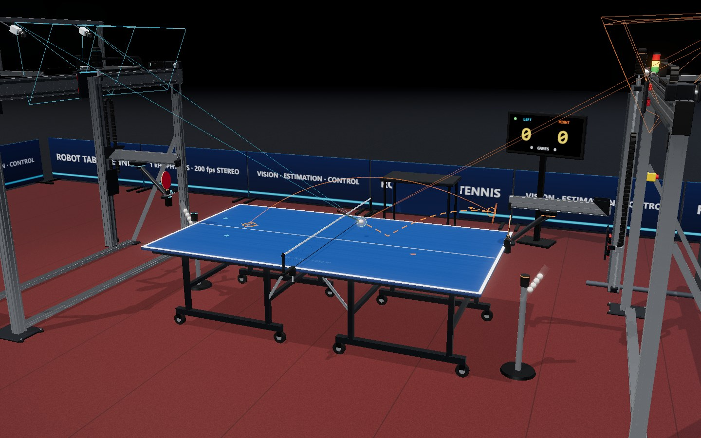
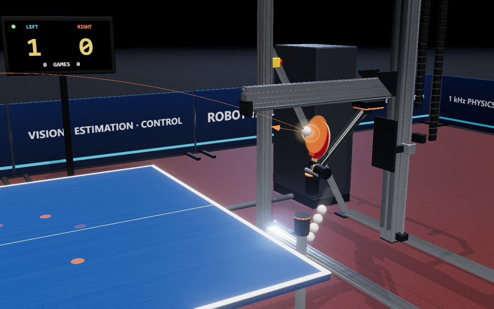
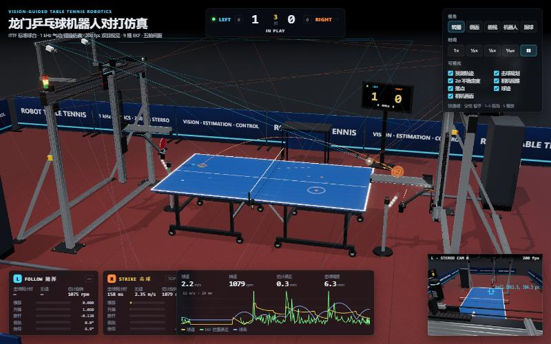
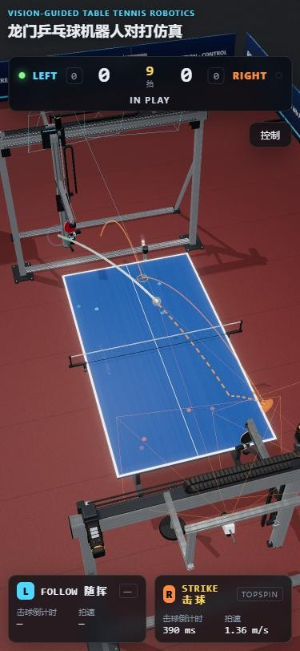

# 龙门乒乓球机器人对打仿真 · Ping Pong Robot Arena

两台五轴龙门式乒乓球机器人在 ITTF 标准球台上闭环对打的 Three.js 仿真。
回球不是动画、也不是"球靠近就改速度"，而是**感知 → 估计 → 规划 → 伺服 → 物理接触**整条链路的结果：
球拍真实地以规划的姿态和速度撞上球，球的去向完全由碰撞模型和空气动力学决定。



| 击球瞬间：真实球拍与规划的虚影球拍重合 | 工程仪表盘与机器人相机画中画 | 移动端 |
| --- | --- | --- |
|  |  |  |

## 亮点

| 模块 | 模型 | 文件 |
| --- | --- | --- |
| 球体动力学 | 重力 + 二次空气阻力 + 马格努斯力（升力系数随旋转比饱和）+ 旋转衰减，RK4 @ 1 kHz | `src/sim/ballPhysics.js` |
| 接触模型 | 薄壁球壳冲量模型：法向恢复系数随冲击速度变化，库仑摩擦，滑动 / 滚动自动切换；用于球台、球网、台边与球拍 | `src/sim/ballPhysics.js` |
| 视觉 | 每台机器人一套 200 fps 双目相机：针孔投影、亚像素噪声、掉帧、6 ms 流水线延迟、射线中点三角化、按测距推导的测量协方差 | `src/sim/perception.js` |
| 状态估计 | 9 维 EKF（位置、速度、**旋转**），过程模型与仿真同构并包含台面弹跳，有限差分雅可比，Joseph 形式更新，χ² 门限检测击球并重置 | `src/sim/estimator.js` |
| 击球规划 | 拦截点代价优化 → 打靶法求出球速度 → 牛顿法反解拍面法向与拍速（含向上刷球产生上旋）→ 全物理回放校验过网高度与落点 | `src/sim/planner.js` |
| 发球 | 抛球器 + 三方程打靶（一跳在本方、二跳落点），并按 ITTF 规则判定 | `src/sim/planner.js` |
| 机器人 | 横移(皮带) / 升降(滚珠丝杠) / 推杆(直线电机) / 偏航 / 俯仰五轴；五次多项式轨迹 + 带速度/加速度饱和的伺服模型 | `src/sim/robot.js`, `src/sim/agent.js` |
| 裁判 | 11 分制、两分领先、每两分换发、10 平后每分换发、每局换先发、五局三胜；发球失误、擦网重发、二跳、连击、拦击、出界 | `src/sim/referee.js` |
| 3D 建模 | T 型槽铝型材截面拉伸、带沟槽导轨与滑块、伺服电机、同步带与带轮、滚珠丝杠、动态拖链、双目相机支架、三色灯、电控柜 HMI、发球器；ITTF 球台（分体台面、折叠底架、万向轮、网架夹具）| `src/render/*` |
| 可视化 | 预测轨迹、规划出球轨迹与落点、虚影球拍与法向、2σ 不确定度椭球、相机视锥与检测射线、落点标记、机器人相机画中画（含检测框与投影预测）| `src/render/overlays.js`, `src/ui/hud.js` |

## 模型细节

### 1. 球的飞行

状态 `s = [p, v, ω]`，ITTF 参数：直径 40 mm、质量 2.7 g、球台 2.74 × 1.525 × 0.76 m、网高 15.25 cm。

```
dv/dt = −g ŷ − k_D |v| v + k_M r (ω × v) / (1 + 2S)
dω/dt = −c_ω ω
k_D = ρ C_D A / 2m,   k_M = ρ A / 2m,   S = r |ω⊥| / |v|
```

升力系数 `C_L = S/(1+2S)`：低旋转时 `C_L ≈ S`，高旋转时饱和到 0.5，避免了常见线性模型在强旋转下的发散。
每个球的 `C_D` 和升力系数都有 ±3–5 % 的随机偏差，而 EKF 只知道标称值——估计器必须面对真实存在的模型失配。

### 2. 接触

对接触法向 `n` 和接触点相对滑移 `u = v_t + ω × (−r n)`：

```
J_n = m (1 + e(v_n)) |v_n|
J_t = min(μ J_n, 2/5 · m |u|)        ← 2/5 来自薄壁球壳 I = 2/3 m r²
v' = v + (J_n n − J_t û) / m
ω' = ω + r J_t (n × û) / I
```

球台恢复系数随冲击速度下降，30 cm 自由落体回弹约 23 cm（ITTF 检验标准，见测试）。球拍面带速度（`σ n + β t`，β 为向上刷球速度），所以同一模型自然产生上旋、下旋和侧旋。
真实接触还包含规划器不知道的部分：偏离拍面甜区时恢复系数最多下降 30 %（拍面振动吸能），胶皮恢复系数与摩擦随每拍的温度、磨损浮动 3 % / 8 %。

### 3. 感知与估计

- 相机：1920×1200、72° 水平视场、基线 0.8 m，像素噪声 σ = 0.45 px，1.5 % 掉帧，6 ms 延迟。
- 测量协方差：横向 `σ = dσ_px/f`，纵深 `σ = d²σ_px/(f b)`——远端球的深度误差约为近端的 5 倍以上。
- EKF 预测步直接调用仿真的 `stepBall`，包括台面弹跳；遇到弹跳时额外注入过程噪声。旋转不可直接测量，靠马格努斯曲率和弹跳"踢"变得可观——测试中 260 rad/s 的上旋能在 0.4 s 内被估计出来。
- 对方击球会让新息超出 χ²(3) 门限；连续两帧离群即用最新两帧测量重新初始化。

### 4. 规划与控制

1. **拦截点**：对 EKF 预测轨迹在本方弹跳后的每个采样点做可达性检查（逆运动学 + 关节余量 + 台面间隙），按击球高度、球的竖直速度、驱动负载（五次多项式峰值加速度 `5.77 Δq / T²`）排序，保留多个候选。
2. **目标**：策略在每个来球只选一次目标（深度、线路、飞行时间、是否拉上旋），之后 100 Hz 重规划只微调。
3. **打靶**：牛顿法求解 `p(T; p_hit, v_out, ω_out) = L`，使用完整气动模型。
4. **反解拍面**：给定入射 `(v_in, ω_in)` 和期望出射 `v_out`，牛顿法求 `(n, σ)`；出射旋转反过来影响飞行，二者迭代三轮。
5. **轨迹**：每个直线轴先用五次多项式到达预摆位（静止），再用 0.17 s 的五次多项式挥拍，在击球瞬间正好达到 `(q_hit, q̇_hit)`；随后随挥减速并复位。击球前 20 ms 冻结规划。
   当引拍或随挥会超出轴行程时，按剩余行程缩短该段时长而不是冲撞限位；所需加速度超过驱动能力的击球方案在规划阶段即被拒绝。
6. **伺服**：18 Hz 带宽 PD + 加速度前馈，速度与加速度饱和；腕部有约 0.3° 的静态标定偏差和每拍约 0.25° 的齿隙误差。
7. **风格**：两台机器人的进攻性不同——进攻性越高，落点越贴近边线、弧线越平、过网余量越小，得分和失误都随之增加。

## 运行

```bash
npm install
npm run dev
```

快捷键：`空格` 暂停 · `1–5` 切换视角（转播 / 侧面 / 俯视 / 机器人 / 跟球）· `S` 慢放。

```bash
npm test          # 26 个单元与集成测试
npm run bench     # 无头仿真基准（默认 4 个随机种子 × 120 s）
npm run build
```

## 验证

`npm test` 覆盖：ITTF 弹跳检验、终端速度、RK4 收敛、马格努斯方向、冲量能量守恒与滚动条件、球网拦截、三角化精度、深度误差随距离平方增长、EKF 定位精度与旋转可观性、击球后滤波器重置、拍面反解往返、打靶落点、完整击球规划、正逆运动学一致性、五次多项式边界条件、引拍与随挥不越过限位、相机帧时间戳无滑移、发球轮换 / 平分 / 局分 / 重发 / 二跳 / 连击判罚、固定种子的确定性回放、60 s 闭环对打。

`npm run bench` 的一次典型输出（4 × 120 s 仿真）：

```
simulated 480 s in 24.3 s  (×19.8 real time)
points 35  ·  hits/point mean 15.5  median 9  max 65
outgoing ball speed  mean 7.55 m/s  p95 10.21 m/s
outgoing spin        mean 551 rpm  p95 827 rpm
hit-point prediction mean 9.4 mm  p95 21.4 mm
contact timing       mean -0.1 ms  p95 |dt| 3.0 ms
point endings: OUT 18 · MISSED 15 · WRONG SIDE 2
```

失分主要来自贴线球出界和接不住高速球。它们由瞄准风险、视觉噪声、模型失配、甜区/胶皮差异和腕部误差共同造成，代码中没有"按概率故意失误"的逻辑。

## 目录

```
src/
  sim/            与渲染无关，可在 Node 中运行
    constants.js  ITTF 尺寸与物理常数
    ballPhysics.js 飞行动力学与冲量接触
    perception.js 双目相机与三角化
    estimator.js  9 维 EKF
    planner.js    拦截、打靶、拍面反解、校验
    robot.js      龙门运动学、五次多项式、伺服模型
    agent.js      单台机器人的状态机与策略
    referee.js    ITTF 规则
    simulation.js 1 kHz 世界循环
  render/         Three.js 场景：材质、零件库、机器人、球台、场馆、叠加层
  ui/hud.js       仪表盘、遥测曲线、画中画
tests/            Vitest
scripts/benchmark.js
```

## 版本

`1.1.0` —— 从演示动画重构为闭环物理仿真。
